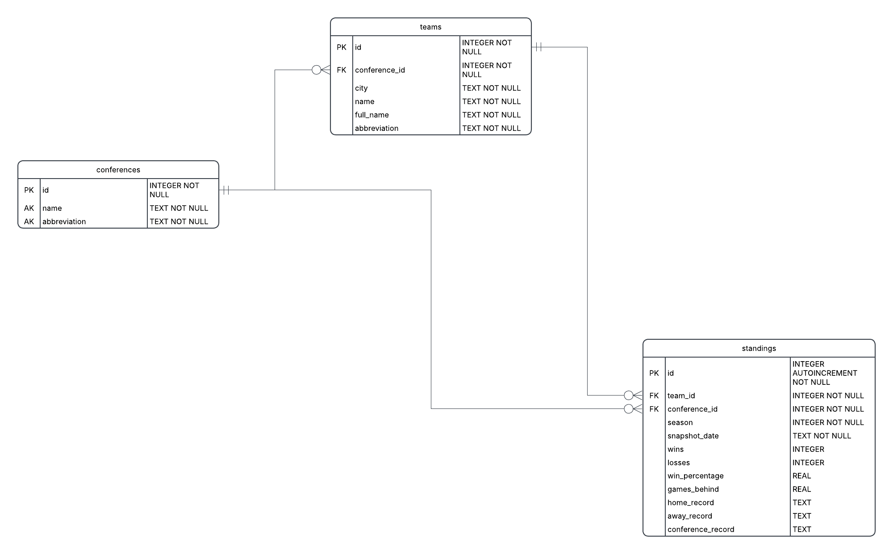

**2026 NCAAF FBS Standings & AI Dashboard**

This project is an automated data pipeline and interactive Streamlit dashboard that tracks the 2026 NCAA Football Bowl Subdivision (FBS) season. It fetches daily snapshot data from the balldontlie API, processes it into a relational SQLite database, and integrates a Large Language Model (LLM) to provide automated text summaries and answer user questions based strictly on current team records.

**Core Features**
* **Automated Data Pipeline:** GitHub Actions fetches daily JSON snapshots of NCAAF conferences, teams, and standings.
* **Dynamic Database:** A local SQLite database rebuilds at runtime to ensure the dashboard always queries the latest relational data.
* **Interactive Dashboard:** Users can filter standings by conference and view multi-month win/loss trend visualizations.
* **AI Integration:** An automated script generates a daily markdown summary of the league, and a live chatbot answers plain-English questions scoped entirely to the local SQLite database context to prevent hallucinations.

**Architecture & Data Flow**
* **Data Ingestion:** `src/fetch.py` triggers daily to pull API data into `data/YYYY-MM-DD.json`.
* **AI Summarization:** `src/summarize.py` reads the fresh data and generates `data/summary.md` via the LLM API.
* **Database Build:** Upon deployment/startup, `src/app.py` triggers `src/build_db.py` to parse the latest JSON snapshot into `project.db`.
* **Frontend Rendering:** Streamlit queries the database using `src/analyze.py`, displays the tables, charts, and daily summary, and hosts the live conversational AI agent.

We are joining the tables conference, team, players, and standings by the conference_id.

### Team 3 - Sprint Roles

SPRINT 1: DATA PIPELINE (Sep 10 – Sep 24) 
Scrum Master: Aaron | Tester: Robiel | Developer: Wyatt & Krish

SPRINT 2: DASHBOARD & AUTOMATION (Oct 1 – Oct 15) Scrum Master: Krish | Tester: Aaron | Developer: Robiel & Wyatt

BUFFER & LAUNCH PHASE (Oct 22) 
Scrum Master: Robiel | Tester: Wyatt | Developer: Krish & Aaron

SPRINT 3: AI LAYER & INTEGRATION (Oct 29 – Nov 12) 
Scrum Master: Wyatt | Tester: Robiel | Developer: Krish & Aaron

WRAP-UP & SHOWCASE (Nov 19 – Dec 10) 
Scrum Master: Robiel | Tester: Krish | Presenters: Aaron & Wyatt

### Schema Markdown

### `conferences`
| Key | Column | Type | Constraints |
| :--- | :--- | :--- | :--- |
| **PK** | id | INTEGER | NOT NULL |
| AK | name | TEXT | NOT NULL |
| AK | abbreviation | TEXT | NOT NULL |

### `teams`
| Key | Column | Type | Constraints |
| :--- | :--- | :--- | :--- |
| **PK** | id | INTEGER | NOT NULL |
| FK | conference_id | INTEGER | NOT NULL |
| | city | TEXT | NOT NULL |
| | name | TEXT | NOT NULL |
| | full_name | TEXT | NOT NULL |
| | abbreviation | TEXT | NOT NULL |

### `standings`
| Key | Column | Type | Constraints |
| :--- | :--- | :--- | :--- |
| **PK** | id | INTEGER | AUTOINCREMENT NOT NULL |
| FK | team_id | INTEGER | NOT NULL |
| FK | conference_id | INTEGER | NOT NULL |
| | season | INTEGER | NOT NULL |
| | snapshot_date | TEXT | NOT NULL |
| | wins | INTEGER | |
| | losses | INTEGER | |
| | win_percentage | REAL | |
| | games_behind | REAL | |
| | home_record | TEXT | |
| | away_record | TEXT | |
| | conference_record | TEXT | |

  

sudo